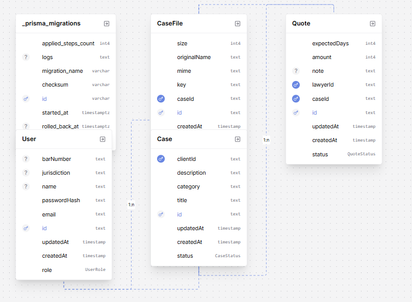

# Sibyl API

Express-based API for the Sibyl mini legal marketplace.

- Base path: `/api`
- Auth: Bearer JWT (`Authorization: Bearer <token>`)
- Content type: `application/json` unless otherwise noted
- Pagination: `page` (1-based), `pageSize`
- Roles: `CLIENT`, `LAWYER`

## ERD (Simplified)


Notes
- A Case belongs to a Client (User with role CLIENT).
- Quotes are created by Lawyers and belong to a Case.
- CaseFiles belong to a Case.
- Lawyers can only see case files if their quote has been accepted for that case.
- PII in case `title` and `description` is redacted (emails/phones) in marketplace and general case responses.

## Environment Variables

Required (examples)
- DATABASE_URL — Postgres connection string
- JWT_SECRET — secret for signing JWTs
- CORS_ORIGIN — allowed origin, e.g. `http://localhost:3000`, `https://your-web.vercel.app`
- STRIPE_SECRET_KEY — Stripe secret key (server-only)
- STRIPE_WEBHOOK_SECRET — Stripe webhook signing secret (server-only)

File storage (Supabase example)
- SUPABASE_URL — your Supabase project URL
- SUPABASE_SERVICE_ROLE_KEY — service role key (server-only)
- SUPABASE_BUCKET — private bucket name (e.g. `sibyl-legal-marketplace`)
- SUPABASE_SIGNED_URL_TTL_SECONDS — e.g. `300`

Ensure the storage bucket is private. The API uploads via the service role and issues signed URLs for time-limited downloads.

## Auth

### POST /api/auth/signup/client
Create a client user.

Request
```json
{ 
    "email": "client@example.com", 
    "password": "secret123",
    "name": "Alice"
}
```

Response
```json
{
  "token": "JWT_TOKEN",
  "role": "CLIENT",
  "name": "Alice"
}
```

### POST /api/auth/signup/lawyer
Create a lawyer user.

Request
```json
{ 
    "email": "lawyer@example.com", 
    "password": "secret123",
    "name": "Bob",
    "jurisdiction": "CA",
    "barNumber": "123456"
}
```

Response
```json
{
  "token": "JWT_TOKEN",
  "role": "LAWYER",
  "name": "Bob"
}
```

### POST /api/auth/login
Login with email and password.

Request
```json
{ 
    "email": "client@example.com", 
    "password": "secret123"
}
```

Response
```json
{
  "token": "JWT_TOKEN",
  "role": "CLIENT",
  "name": "Alice"
}
```


## Cases

### GET /api/cases/my
Get all cases for the authenticated user.

Request
```http
GET /api/cases
Authorization: Bearer JWT_TOKEN
```

Response
```json
{
    "data": [
        {
            "id": "CASE_ID",
            "title": "Case Title",
            "description": "Case description",
            "status": "open|engaged|closed|cancelled",
            "createdAt": "2023-01-01T00:00:00.000Z",
            "updatedAt": "2023-01-01T00:00:00.000Z"
        }
    ],
    "meta": {
        "total": 1,
        "totalPages": 1,
        "hasNext": false,
        "hasPrev": false
    }
}
```

### GET /api/cases/:id
Get a case by ID.

Request
```http
GET /api/cases/:id
Authorization: Bearer JWT_TOKEN
```

Response
```json
{
        "id": "CASE_ID",
        "title": "Case Title",
        "description": "Case description",
        "status": "open|engaged|closed|cancelled",
        "createdAt": "2023-01-01T00:00:00.000Z",
        "updatedAt": "2023-01-01T00:00:00.000Z",
        "files": [
            {
                "id": "FILE_ID",
                "key": "FILE_KEY",
                "mime": "FILE_MIME",
                "originalName": "FILE_ORIGINAL_NAME",
                "size": 12345,
                "createdAt": "2023-01-01T00:00:00.000Z"
            }
        ]
}
```

### POST /api/cases
Create a new case.

Request
```json
{
    "title": "Case Title",
    "description": "Case description",
    "status": "open|engaged|closed|cancelled"
}
```

Response
```json
{
    "id": "CASE_ID",
    "title": "Case Title",
    "description": "Case description",
    "status": "open|engaged|closed|cancelled",
    "createdAt": "2023-01-01T00:00:00.000Z",
    "updatedAt": "2023-01-01T00:00:00.000Z"
}
```

### GET /api/cases/marketplace
Get all cases for the marketplace.

Request
```http
GET /api/cases/marketplace
Authorization: Bearer JWT_TOKEN
```

Response
```json
{
    "data": [
        {
            "id": "CASE_ID",
            "title": "Case Title",
            "description": "Case description",
            "status": "open|engaged|closed|cancelled",
            "createdAt": "2023-01-01T00:00:00.000Z",
            "updatedAt": "2023-01-01T00:00:00.000Z"
        }
    ],
    "meta": {
        "total": 1,
        "totalPages": 1,
        "hasNext": false,
        "hasPrev": false
    }
}
```

## Quotes

### GET /api/quotes/my 
Get all quotes for the authenticated user.

Request
```http
GET /api/quotes/my
Authorization: Bearer JWT_TOKEN
```

Response
```json
{
    "data": [
        {
            "id": "QUOTE_ID",
            "caseId": "CASE_ID",
            "lawyerId": "LAWYER_ID",
            "amount": 12345,
            "expectedDays": 7,
            "note": "Note",
            "status": "proposed|accepted|rejected",
            "createdAt": "2023-01-01T00:00:00.000Z",
            "updatedAt": "2023-01-01T00:00:00.000Z"
        }
    ],
    "meta": {
        "total": 1,
        "totalPages": 1,
        "hasNext": false,
        "hasPrev": false
    }
}
```

### GET /api/quotes/:id
Get a quote by ID.

Request
```http
GET /api/quotes/:id
Authorization: Bearer JWT_TOKEN
```

Response
```json
{
    "id": "QUOTE_ID",
    "caseId": "CASE_ID",
    "lawyerId": "LAWYER_ID",
    "amount": 12345,
    "expectedDays": 7,
    "note": "Note",
    "status": "proposed|accepted|rejected",
    "createdAt": "2023-01-01T00:00:00.000Z",
    "updatedAt": "2023-01-01T00:00:00.000Z"
}
```

### POST /api/quotes/:caseId
Create a new quote for a case.

Request
```json
{
    "amount": 12345,
    "expectedDays": 7,
    "note": "Note"
}
```

Response
```json
{
    "id": "QUOTE_ID",
    "caseId": "CASE_ID",
    "lawyerId": "LAWYER_ID",
    "amount": 12345,
    "expectedDays": 7,
    "note": "Note",
    "status": "proposed|accepted|rejected",
    "createdAt": "2023-01-01T00:00:00.000Z",
    "updatedAt": "2023-01-01T00:00:00.000Z"
}
```

### POST /api/quotes/:caseId/accept
Accept a quote.

Request
```http
POST /api/quotes/:caseId/accept
Authorization: Bearer JWT_TOKEN
```

Response
```json
{
    "ok": true,
    "message": "checkout url created",
    "session": {
        "id": "SESSION_ID",
        "url": "https://checkout.stripe.com/..."
        ...
    }
}
```

## Files

### POST /api/files/:caseId/upload
Upload files to a case.

Request
```http
POST /api/files/:caseId/upload
Authorization: Bearer JWT_TOKEN
```

Response
```json
{
    "files": [
        {
            "id": "FILE_ID",
            "key": "FILE_KEY",
            "mime": "FILE_MIME",
            "originalName": "FILE_ORIGINAL_NAME",
            "size": 12345,
            "createdAt": "2023-01-01T00:00:00.000Z"
        }
    ]
}
```

### GET /api/files/:fileId/download
Get a signed download URL for a file.

Request
```http
GET /api/files/:fileId/download
Authorization: Bearer JWT_TOKEN
```

Response
```json
{
    "url": "https://example.com/file"
}
```

